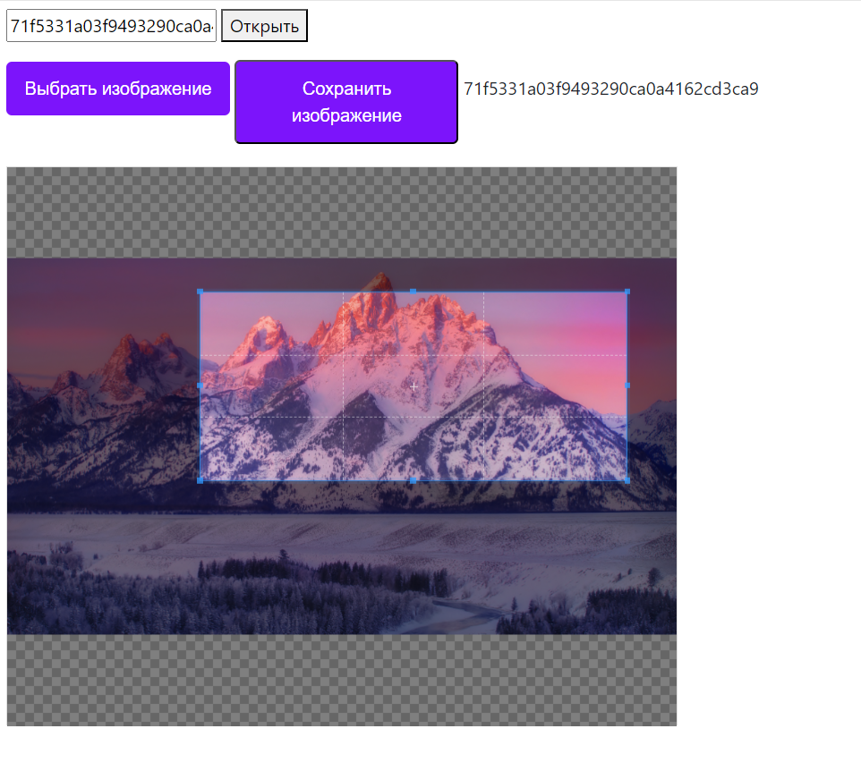

Клиет серверное приложение для обрезки фото. 
Разработано при помощи Flask

При помощи кнопки "Выбрать изображение"
выбирается изображение с компьютера.
После обрезается и сохраняется через кнопку
"Сохранить изображение".
После сохранения поялвяется код изображения.
По коду изображения его можно получить. 
Изображение открывается после нажатия кнопки
открыть в отвельной вкладке.

